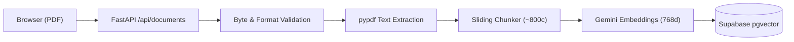
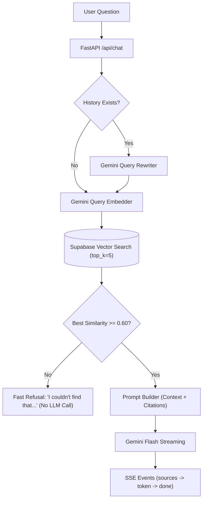

# DocuMind

> A minimal, citation-backed document search and chat system that answers user queries strictly from uploaded PDFs with exact page references.

---

## Features

- **Grounded Question Answering:** Answers questions strictly using uploaded PDF context, citing the exact document and page number for every claim (e.g. `(report.pdf, p. 3)`).
- **Early-Exit Refusal:** Questions outside the document's contents are rejected immediately without calling the LLM, eliminating hallucinations and saving API quota.
- **Real-Time Token Streaming:** Delivers answers progressively using Server-Sent Events (SSE) with sub-second time-to-first-token.
- **Conversational Memory & Query Rewriting:** Automatically reformulates contextual follow-up questions (e.g. *"What about fish?"*) into standalone search queries.
- **Robust PDF Parsing & Validation:** Validates magic byte headers, enforces file size (<= 10 MB) and page limits (<= 100 pages), and detects scanned image PDFs.

---

## Tech Stack

| Technology | Role | Why Chosen |
|---|---|---|
| **Next.js 15 (App Router)** | Frontend Framework | Fast React server components, modern client state management, and native Vercel integration. |
| **TypeScript** | Programming Language | End-to-end type safety across API contracts, SSE stream events, and UI components. |
| **Tailwind CSS** | Styling | Utility-first architecture enabling responsive design tokens and custom glassmorphism styles. |
| **FastAPI** | Backend Framework | High-performance async Python web framework with native OpenAPI docs and SSE streaming. |
| **Python 3.11** | Backend Runtime | Industry standard for AI engineering pipelines, scientific computation, and vector operations. |
| **Google Gemini (Flash & Embeddings)** | LLM & Embeddings | Cost-effective inference with fast generation, strong citation adherence, and 768-dim embeddings. |
| **Supabase Postgres (`pgvector`)** | Vector Database | Scalable relational database with native HNSW vector cosine distance indexing. |
| **Render** | Backend Hosting | Docker container deployment with automatic health checks and environment secret management. |
| **Vercel** | Frontend Hosting | Global edge distribution with zero-config Next.js continuous deployment. |

---

## Architecture

### 1. Ingestion Pipeline (Upload Flow)


### 2. Retrieval & Generation Pipeline (Question Flow)


---

## How RAG Works (In 5 Steps)

1. **Extract & Clean:** The uploaded PDF is parsed page-by-page, retaining the exact physical page numbers for every section.
2. **Chunk:** The document text is cut into coherent, overlapping chunks (~800 characters with 120 character overlap) so ideas aren't severed mid-sentence.
3. **Embed:** Each text chunk is converted by Gemini into a 768-dimensional mathematical vector capturing its semantic meaning.
4. **Retrieve:** When a question is submitted, it is vectorized and compared against stored chunks using cosine similarity to find the top 5 closest matches.
5. **Generate with Citations:** If relevance meets the threshold (>= 0.60), the LLM generates a streamed response constrained strictly to the retrieved context, citing every claim with `(filename, p. N)`.

---

## Evaluation & Quality Results

DocuMind was evaluated using an empirical 15-question benchmark test set against a 7-page reference guide (`home_cooks_handbook.pdf`).

| Metric | Result | Details |
|---|---|---|
| **Answer Accuracy & Page Citations (Groups A & C)** | **12 / 12 (100%)** | All 12 in-document and follow-up questions answered accurately with correct page citations. |
| **Off-Topic Refusals (Group B)** | **3 / 3 (100%)** | Correctly triggered fast-path refusal for ungrounded queries (*"What is the capital of France?"*). |
| **Overall Pass Rate** | **15 / 15 (100%)** | Zero hallucinations, zero incorrect citations. |
| **Average Time to First Token (TTFT)** | **2,754 ms** | Measured from request dispatch to the first visible token chunk. |
| **Average Total Response Time** | **3,059 ms** | Full answer streaming duration. |
| **Fast-Path Refusal Latency** | **~1,150 ms** | Bypasses LLM generation completely when similarity is below threshold. |

> **Note on Evaluation Scope:** This evaluation was conducted on one 7-page document with 15 target questions. It demonstrates that the retrieval logic, citation constraints, and similarity gates work as designed on structured text, but it does not represent generalized benchmark accuracy across all arbitrary document types.

---

## Key Tuning Decisions

| Parameter | Value | Why Chosen |
|---|---|---|
| **Chunk Size** | `800 chars` | Large enough to preserve self-contained thoughts, small enough to isolate specific answers without diluting vector similarity. |
| **Chunk Overlap** | `120 chars` | Prevents losing concepts that straddle chunk boundaries while minimizing redundant storage. |
| **Top K (`top_k`)** | `5` | Provides sufficient context coverage for complex answers without overflowing prompt size or introducing irrelevant noise. |
| **Similarity Threshold** | `0.60` | Provides clean separation: 100% on-topic recall (scores `0.62`–`0.88`) and 100% off-topic rejection (scores `< 0.58`). |

---

## Honest Limitations

- **Anonymous Sessions are Not True Security:** Session isolation relies on random UUIDs stored in `localStorage` and sent via `X-Session-Id`. Anyone with access to the UUID can access that session's documents. Production systems require authenticated identity (e.g., Supabase Auth).
- **Free-Tier Cold Starts:** Render Web Services spin down after 15 minutes of inactivity; initial wake-up takes 30–60 seconds (handled gracefully in the UI via a cold-start banner).
- **Text-Based PDFs Only:** Only PDFs containing digital text layers are supported. Scanned image PDFs without OCR are detected and rejected.
- **Daily AI Quota:** In-memory request counters (`GEMINI_DAILY_LIMIT` and `EMBED_DAILY_LIMIT`) cap daily calls to protect free-tier quotas.
- **Single-Document Benchmark:** Current quality numbers reflect a 15-question benchmark on a 7-page document; complex multi-column layouts and dense tables require specialized chunking.

---

## What I Learned

1. **Retrieval Precision Outweighs Model Parameter Size:** A lightweight, fast model (`gemini-3.5-flash-lite`) produces reliable, citation-perfect answers when fed high-quality chunks. Feeding dirty or irrelevant chunks causes hallucinations regardless of model size.
2. **Threshold Guardrails Drastically Improve Latency & Cost:** Short-circuiting off-topic queries before invoking the LLM reduced off-topic latency from ~3.1s down to ~1.1s and saved 100% of LLM token costs.
3. **Conversational Memory Demands Query Rewriting:** Real users frequently ask multi-turn questions (*"How long does the sauce take?"*). Without rewriting the query using chat history into a standalone question, vector search retrieves zero relevant chunks.
4. **Preserving Page Numbers Requires Intra-Page Chunking:** Splitting text across page boundaries breaks citation integrity. Chunks must be split *within* each page boundary so every excerpt retains a single, verified page index.
5. **UX State Design is as Critical as the AI Pipeline:** Real-world RAG apps encounter network latency, sleeping containers, and API rate limits. Handling cold-starts, streaming delays, and polite quota errors is essential for a good user experience.

---

## Next Steps

- [ ] **Authentication:** Replace anonymous sessions with Supabase Auth or Clerk for secure user accounts.
- [ ] **Interactive Source Cards:** Render clickable excerpt cards in the UI showing the exact quote alongside the cited page.
- [ ] **Cost & Token Telemetry:** Track token usage and API cost per session in real time.
- [ ] **OCR Ingestion:** Add Tesseract or Google Cloud Vision OCR to parse scanned physical documents.
- [ ] **Hybrid Search & Re-Ranking:** Combine BM25 keyword search with pgvector embeddings and cross-encoder re-ranking.

---

## Running Locally

### 1. Prerequisites
- Node.js 20+
- Python 3.11+
- Supabase account with `pgvector` enabled
- Google Gemini API key

### 2. Backend Setup
```bash
cd backend
python -m venv .venv
source .venv/bin/activate  # On Windows: .venv\Scripts\activate
pip install -r requirements.txt
cp .env.example .env       # Fill in GEMINI_API_KEY, SUPABASE_URL, SUPABASE_SERVICE_KEY
uvicorn app.main:app --reload --port 8000
```

### 3. Frontend Setup
```bash
cd frontend
npm install
cp .env.example .env.local  # NEXT_PUBLIC_API_URL=http://localhost:8000
npm run dev
```
Open [http://localhost:3000](http://localhost:3000) in your browser.

---

## License

Distributed under the [MIT License](LICENSE).
