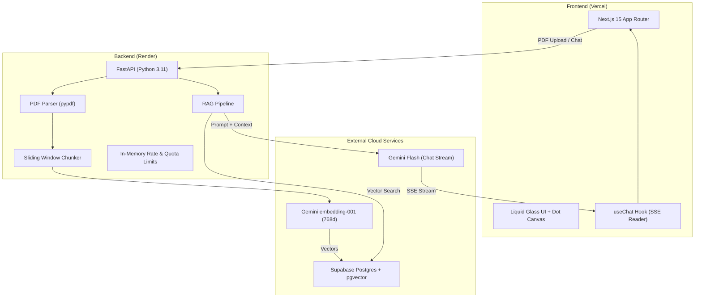
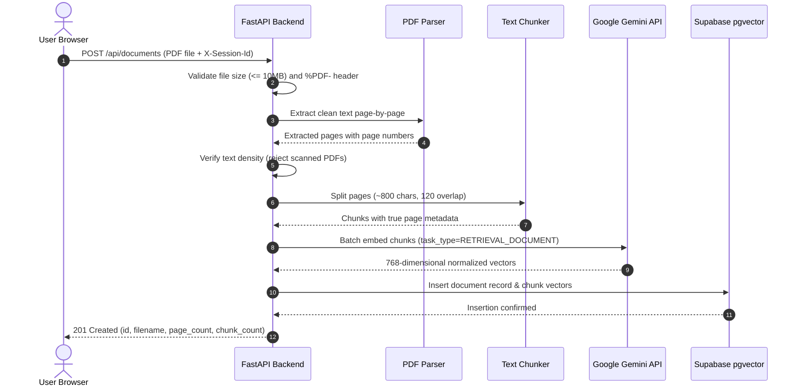
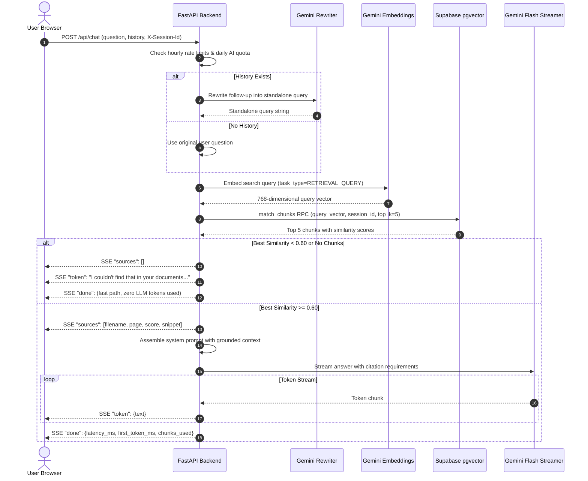

# DocuMind Architecture Diagrams

This document illustrates the end-to-end data flow and system architecture for **DocuMind**.

---

## 1. System Overview

---

## 2. Ingestion Pipeline (Upload Flow)

Runs once per uploaded PDF document:

---

## 3. Query & Retrieval Pipeline (Question Flow)

Runs for every user question:

